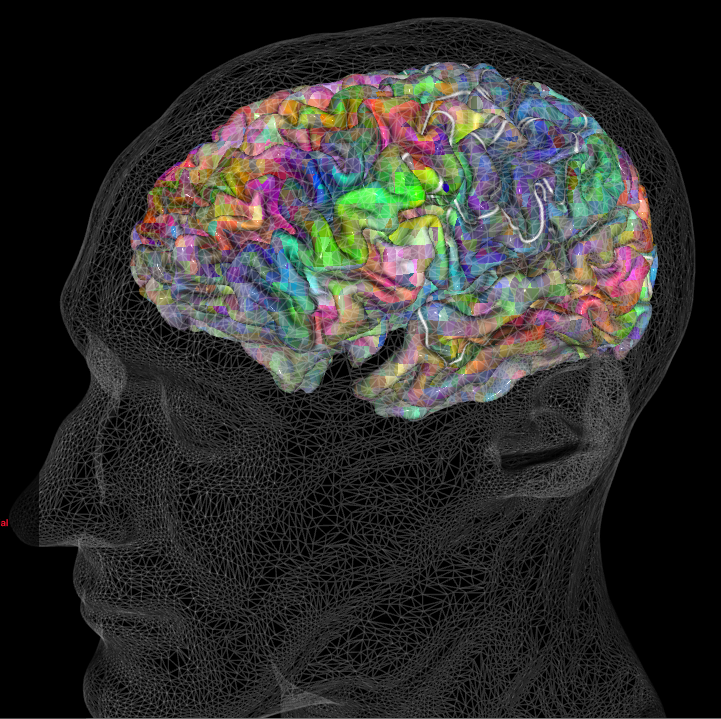
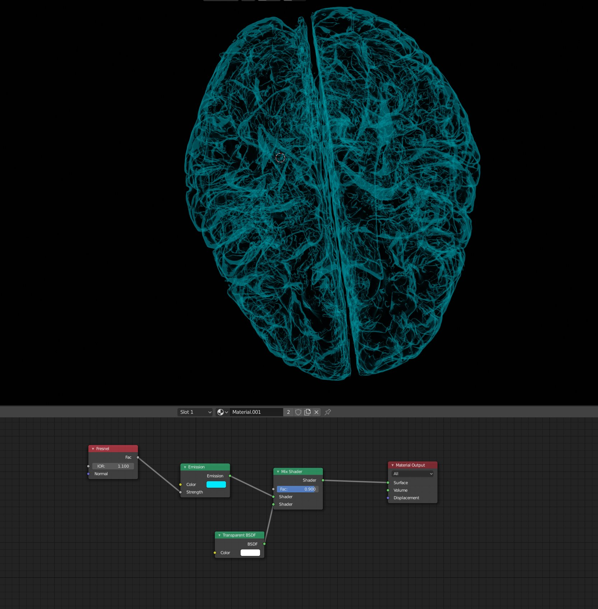
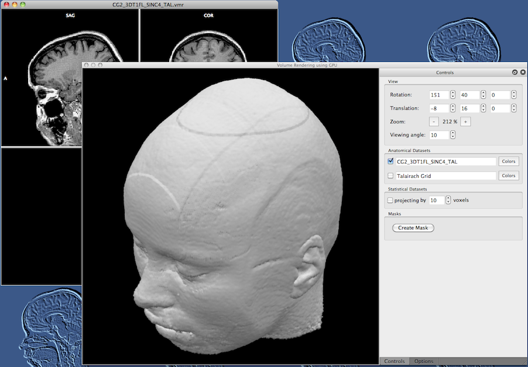

# Demo

* Demo: BrainWithHitDetection

# Dataset

* cnctm_includeMask_cubed_5_maxLabelsPmask_20000/5tt_length_assignAll_cnctm_mat_single_None.h5
* Included voxels with at least one connection
* All connected voxels displayed ('mat' property)
* Connection is a curve going from voxel to voxel with control points pointing towards the center
  * Could replace with tracts, color coding

# Discussion points

* Render a mesh at the surface
* Different datasets
* Add tracts
* Color coding for different areas

# Overview of visualization methods that we can leverage in VR

* Meshes
* Particle systems
* Tracts
* Volume rendering

# Meshes

* Meshes - a list of triangles that parametrize the surface that we're visualizing
* Oftentimes with a custom shader describes how this surface is rendered and interacts with data
* E.g. [pycortex viewer in WebGL](https://gallantlab.org/huth2016/)
* Very large meshes may be loaded using LOD (level-of-detail) swapping

# Particle systems

* Represent 3d data using particles
* Particles may be points, cubes, tetrahedra, sprites, meshes, etc.
* Extremely efficient GPU-based particle systems that can handle 1M+ particles
* [Unity demo real](https://www.youtube.com/watch?v=uUHRJ26gMGI)
* [Super resolution microscopy](https://twitter.com/i/status/1219632763168612355)
* This demo

# Tracts

* [Staging the connectome exhibit](https://www.youtube.com/watch?v=LtsBZlw5nQI)
* [HoloLens demo](https://twitter.com/Dr_Alex_Crimi/status/1217948642067259392)
* BrainVis (available on Oculus Store)

# Volume rendering

# Interactions

* Slicing
* Intersect
* Drag to manipulate
* Joystick motion
* Natural motions (paddling, ice-climbing)

# Tooling

* Transcoding: get data from format X to format Y, in Python
* Display via WebXR (three.js, aframe, etc.). Compatible with Firefox. JS environment.
* Pull data into Unity, a commercial game engine. Coding in C#.
* Pull data into Unreal, a commercial game engine. Coding in C++.

# Alternative routes

* Plugins
  * ImageJ
  * Paraview
* [Other tools assembled by Alessandro Crimi](https://medium.com/@Dr_Alex_Crimi/practical-brain-tractography-and-beyond-ac3c8860306b)
