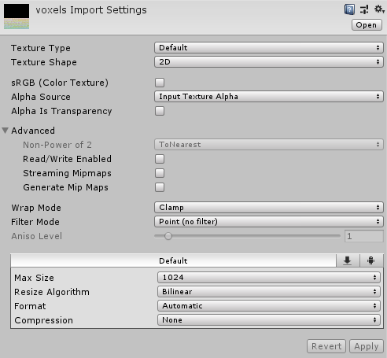
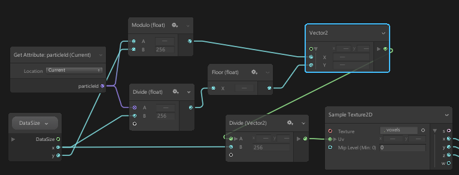

# Textures to encode complex data in VFX graph in Unity3d

VFX graph can use textures as inputs. To use textures to encode complex data, in Unity:

Most importantly:

* Uncheck sRGB (map colors nonlinearly)
* Disable mipmaps
* Use Point Filter mode
* Use compression = None

Then sample into the texture by converting the particle id into uv coordinates, using modulo arithmetic:

